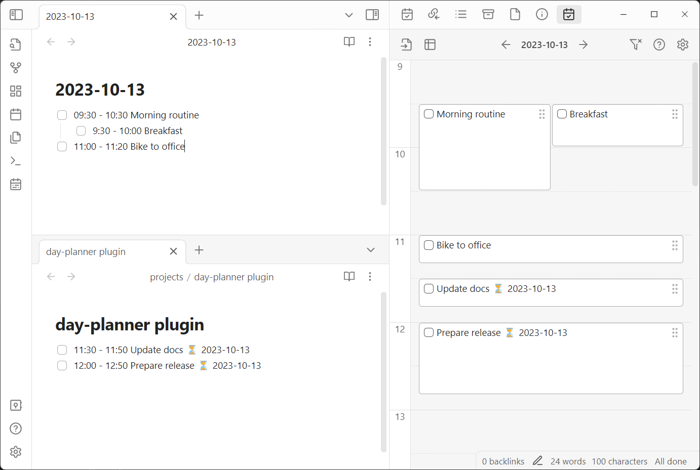
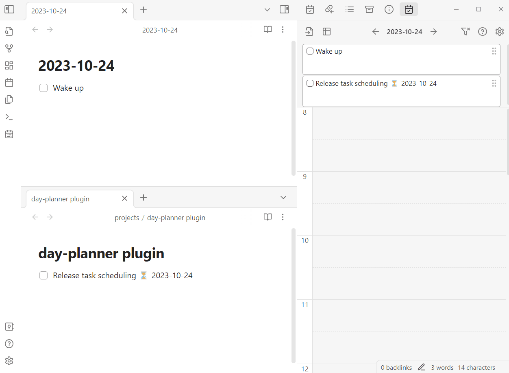
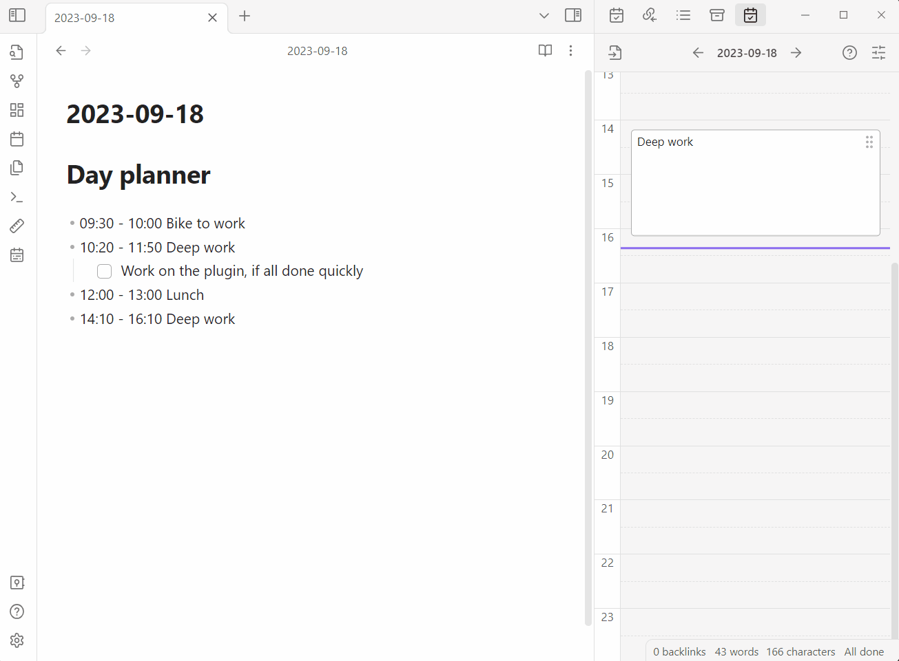
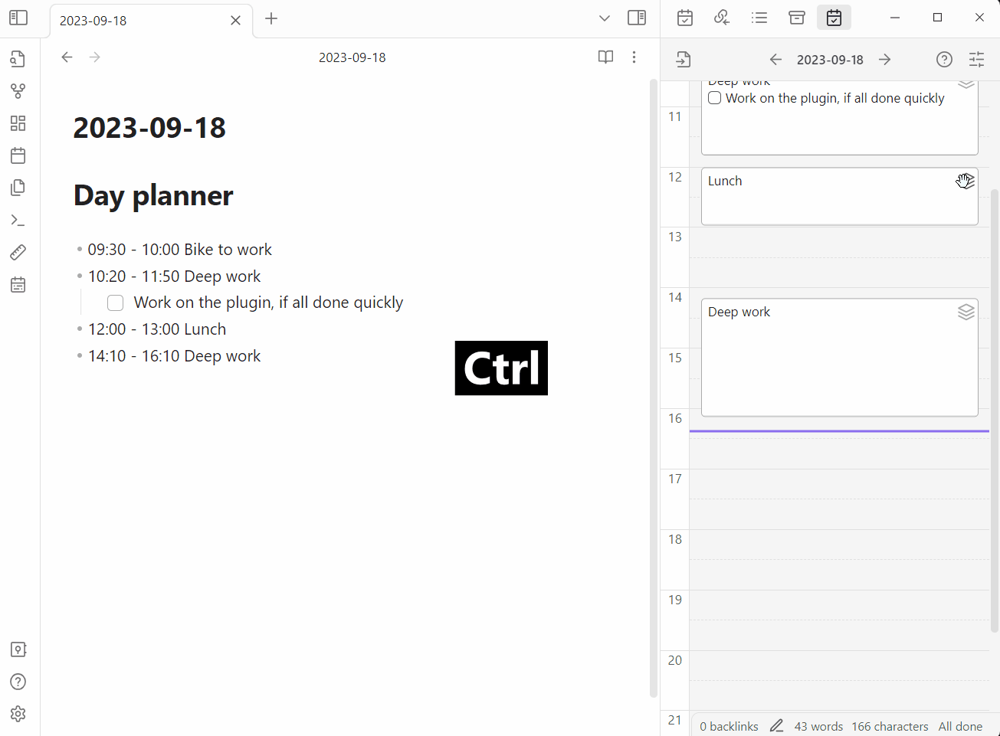

- ✨ [Check out new features and other changes](https://github.com/ivan-lednev/obsidian-day-planner/releases)
- 🪲 [Create issues](https://github.com/ivan-lednev/obsidian-day-planner/issues)
- 🪛 [Submit pull-requests](./CONTRIBUTING.md)
- ❤️ Support directly:

  <a href="https://www.buymeacoffee.com/machineelf" target="_blank"></a>

## Table of contents

- [Table of contents](#table-of-contents)
- [What it looks like](#what-it-looks-like)
- [Drag-and-drop demos](#drag-and-drop-demos)
- [How to use it](#how-to-use-it)
  - [Dataview integration](#dataview-integration)
    - [How to schedule a task anywhere in the vault](#how-to-schedule-a-task-anywhere-in-the-vault)
    - [Dataview source filter](#dataview-source-filter)
- [What else you can do](#what-else-you-can-do)
- [Commands](#commands)
- [Note on the old plugin version](#note-on-the-old-plugin-version)
- [Acknowledgements](#acknowledgements)

## What it looks like




## Drag-and-drop demos

<details>
<summary>Adding time to tasks</summary>



</details>

<details>
<summary>Basic editing: create, move, resize (click to expand)</summary>



</details>

<details>
<summary>Advanced editing: copy, move/resize with neighbors (click to expand)</summary>



</details>

## How to use it

1. **Either the core 'Daily Notes' or the 'Periodic Notes' plugins should be enabled**
1. **The Dataview plugin should be enabled**
1. Install the plugin
1. Open timeline view to monitor your progress with the command: `Show the day planner timeline` or by clicking on the ribbon icon

### Dataview integration

A task is going to show up in the timeline for a given day

- If it's inside a daily note for the day
- Or if it's scheduled for the day

Everything Dataview recognizes as a task is shown in the timeline, including:

- Tasks inside callouts
- Nested tasks. If a nested task has a timestamp, it'll show up as a separate block, and will be excluded from its parent's unscheduled sub-items list

#### How to schedule a task anywhere in the vault

To schedule a task add time and a date that Dataview recognizes: `⏳ 2021-08-29` or `[scheduled:: 2021-08-29]` or `(scheduled:: 2021-08-29)`.

Full examples:

```md
- [ ] 08:00 - 10:00 This task uses the shorthand format (used by obsidian-tasks) ⏳ 2021-08-29
- [ ] 11:00 - 13:00 This task uses the Dataview property format [scheduled:: 2021-08-29]
```

[obsidian-tasks](https://github.com/obsidian-tasks-group/obsidian-tasks) adds a modal with some handy shortcuts for adding dates like these.

#### Dataview source filter

You can set up Dataview to search for tasks only in specific folders or tags. This improves performance on large vaults. [Here are the docs on how to use the syntax](https://blacksmithgu.github.io/obsidian-dataview/reference/sources/).

## What else you can do

- Observe your progress in the status bar
- Use the week view for multi-day planning
- Color tasks based on time
- Click on the timeline to create tasks
- Drag tasks to re-schedule
- Copy tasks by holding <code>Shift</code> while dragging (<strong>note: right now, only single line tasks are supported</strong>)
- Move multiple tasks by holding <code>Control</code> while dragging/resizing

## Commands

- Show the Day Planner Timeline
- Open today's Day Planner
- Show the Week Planner
- Insert Planner Heading at Cursor

## Note on the old plugin version

0.7.0 significantly changes what the plugin looks like and what it does. If you like to have some of the old behaviors back, [consider creating an issue](https://github.com/ivan-lednev/obsidian-day-planner/issues).

If for some reason you still want to use the old version, there are community forks, which you can use via [BRAT](https://github.com/TfTHacker/obsidian42-brat). [Here is one such fork](https://github.com/ebullient/obsidian-day-planner-og).

## Acknowledgements

- Thanks to [James Lynch](https://github.com/lynchjames) for the original plugin
- Thanks to [replete](https://github.com/replete), whose fork I initially forked
- Thanks to [Michael Brenan](https://github.com/blacksmithgu) for Dataview
- Thanks to [Joshua Tazman Reinier](https://github.com/joshuatazrein) for his plugin, which gave me an idea of how to integrate with Dataview
