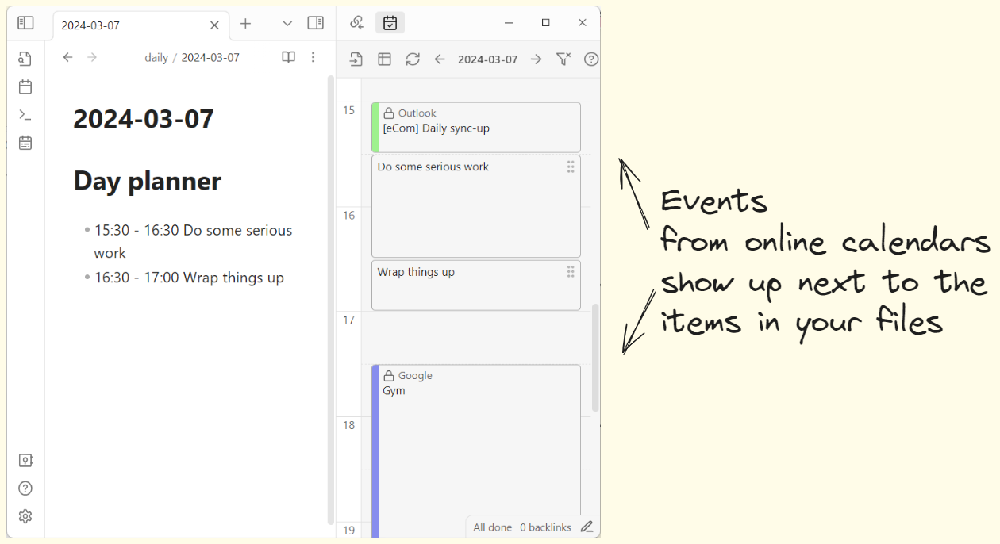
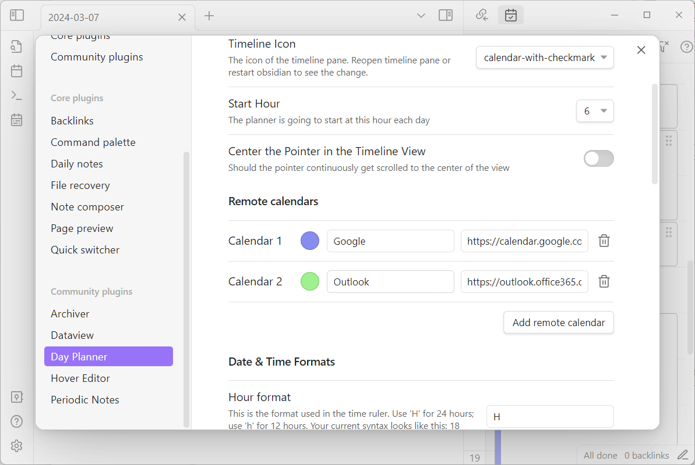

I work on the plugin in my spare time, and I appreciate any kind of support!

✨ [Check out latest updates](https://github.com/ivan-lednev/obsidian-day-planner/releases)<br>
🪲 [Report bugs and suggest features](https://github.com/ivan-lednev/obsidian-day-planner/issues)<br>
❓ [Ask questions](https://github.com/ivan-lednev/obsidian-day-planner/discussions/new?category=q-a)<br>
👍 [Give thumbs up to issues important to you](https://github.com/ivan-lednev/obsidian-day-planner/issues)<br>
🪛 [Submit pull-requests](./CONTRIBUTING.md). If you don't know where to start, create an issue and I'll gladly give you some directions<br>
❤️ Support the project directly:

<a href="https://www.buymeacoffee.com/machineelf" target="_blank"></a>

## Table of contents

- [Table of contents](#table-of-contents)
- [What it looks like](#what-it-looks-like)
- [Drag-and-drop demos](#drag-and-drop-demos)
- [How to use it](#how-to-use-it)
  - [Showing events from your daily notes](#showing-events-from-your-daily-notes)
  - [Showing internet calendars](#showing-internet-calendars)
    - [Where to get a Google Calendar link](#where-to-get-a-google-calendar-link)
    - [Where to get an iCloud link](#where-to-get-an-icloud-link)
    - [Where to get an Outlook link](#where-to-get-an-outlook-link)
      - [Alternative](#alternative)
  - [Showing events from other files in your vault](#showing-events-from-other-files-in-your-vault)
- [What else you can do](#what-else-you-can-do)
- [Commands](#commands)
- [Note on the old plugin version](#note-on-the-old-plugin-version)
- [Acknowledgements](#acknowledgements)

## What it looks like




## Drag-and-drop demos

<details>
<summary>Adding time to tasks</summary>


</details>

<details>
<summary>Basic editing: create, move, resize (click to expand)</summary>


</details>

## How to use it

### Showing events from your daily notes

1. **Either the core 'Daily Notes' or the 'Periodic Notes' plugins should be enabled**
1. **The Dataview plugin should be enabled**
1. Open timeline view the following command: `Show the day planner timeline`

Everything Dataview recognizes as a task is shown in the timeline, including:

- Tasks inside callouts
- Nested tasks. If a nested task has a timestamp, it'll show up as a separate block, and will be excluded from its parent's unscheduled sub-items list

### Showing internet calendars

To show events from internet calendars like **Google Calendar, iCloud Calendar and Outlook** you only need to add an ICS link in the plugin settings.



#### Where to get a Google Calendar link

[Google Calendar instructions](https://support.google.com/calendar/answer/37648?hl=en#zippy=%2Csync-your-google-calendar-view-edit%2Cget-your-calendar-view-only)

#### Where to get an iCloud link

[iCloud Calendar instructions](https://www.souladvisor.com/help-centre/how-to-get-icloud-calendar-address-on-mac-in-ical-format)

#### Where to get an Outlook link

[Outlook Calendar instructions](https://support.microsoft.com/en-us/office/introduction-to-publishing-internet-calendars-a25e68d6-695a-41c6-a701-103d44ba151d?ui=en-us&rs=en-us&ad=us)

Here's the relevant part:

> Under the settings in Outlook **on the web**, go to Calendar > Shared calendars. Choose the calendar you wish to publish and the level of details that you want others to see.

Here's how the settings look on the web version:


##### Alternative

If your organization doesn't let you share your calendar this way, you might try [a different way described in this issue](https://github.com/ivan-lednev/obsidian-day-planner/issues/395).

### Showing events from other files in your vault

1. Include its folder or tag into the Dataview filter
1. Add time and a date that Dataview recognizes: `⏳ 2021-08-29` or `[scheduled:: 2021-08-29]` or `(scheduled:: 2021-08-29)`.

Full examples:

```md
- [ ] 08:00 - 10:00 This task uses the shorthand format (used by obsidian-tasks) ⏳ 2021-08-29
- [ ] 11:00 - 13:00 This task uses the Dataview property format [scheduled:: 2021-08-29]
```

[obsidian-tasks](https://github.com/obsidian-tasks-group/obsidian-tasks) adds a modal with some handy shortcuts for adding dates like these.

## What else you can do

- Observe your progress in the status bar
- Use the week view for multi-day planning
- Color tasks based on time
- Click on the timeline to create tasks
- Drag tasks to re-schedule
- Copy tasks
- Move multiple tasks at once

## Commands

- Show the Day Planner Timeline
- Open today's Day Planner
- Show the Week Planner
- Insert Planner Heading at Cursor

## Note on the old plugin version

0.7.0 significantly changes what the plugin looks like and what it does. If you like to have some of the old behaviors back, [consider creating an issue](https://github.com/ivan-lednev/obsidian-day-planner/issues).

If for some reason you still want to use the old version, there are community forks, which you can use via [BRAT](https://github.com/TfTHacker/obsidian42-brat). [Here is one such fork](https://github.com/ebullient/obsidian-day-planner-og).

## Acknowledgements

- Thanks to [James Lynch](https://github.com/lynchjames) for the original plugin
- Thanks to [replete](https://github.com/replete), whose fork I initially forked
- Thanks to [Michael Brenan](https://github.com/blacksmithgu) for Dataview
- Thanks to [Joshua Tazman Reinier](https://github.com/joshuatazrein) for his plugin, which gave me an idea of how to integrate with Dataview
- Thanks to @liamcain for creating daily note utilities and a helpful calendar plugin
